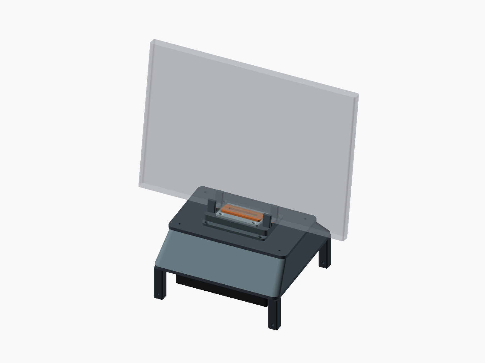

# MacBook Upright Cooler

Experimental external cooling hardware for a 14-inch MacBook Pro M5 Max used in clamshell mode for sustained local-AI workloads and large code compiles.

The project started from the sealed-adapter approach demonstrated by Samuel Gregory with a llano V12 cooling pad, then branched into a smaller upright dock built around a standard 140 mm fan and a pressure plenum.



[V2 STLs](cad/upright_v2/stl/) · [Assembly guide](cad/upright_v2/README.md) ·
[Validation](docs/VALIDATION.md)

V2 is ready for construction and supervised fit checks. Cooling performance and
the final M5 Max interface have **not** been validated. Start with the blank insert.

For V12-powered validation, use the separate [V12 deck adapter](cad/upright_v2/v12_validation/README.md).
Its cooler footprint is unverified: print the small fit gauge and joint coupons
before committing to the full deck. It reuses V2's upper parts without a second fan.

## Current state

There are three prototypes in this folder:

1. **V12 adapter** - a split adapter for the llano V12, intended to test the sealed-pressure approach on the actual M5 Max.
2. **Upright V1** - a 140 mm fan below a plenum and a narrow gasketed outlet. Preserved as the original concept.
3. **Upright V2** - a tapered shell, removable fan cartridge, 10° cradle, padded stops, and replaceable center insert. The laptop interface remains provisional.

## Repository layout

- `cad/v12_adapter/` — current split V12 adapter STLs
- `cad/upright_v1/` — canonical parametric OpenSCAD source and matching STL
- `cad/upright_v2/` - V2 source, assembly guide, and verified STL snapshot; rebuilds go to `build/upright_v2/`
- `renders/` — current previews
- `docs/HANDOFF.md` — project state, decisions, unknowns, and next steps
- `docs/BENCHMARK_PLAN.md` — proposed A/B validation plan
- `docs/VENT_GEOMETRY.md` — supplied GLB/glTF measurements, online evidence, and remaining fit checks
- `tools/` — mesh validation and reference-model inspection
- `AGENTS.md` — instructions for Codex/other coding agents
- `archive/early_cadquery/` — an earlier CadQuery exploration; **not geometrically identical to the canonical V1 OpenSCAD model**

## Canonical upright V1 geometry

The authoritative source for Upright V1 is:

`cad/upright_v1/upright_macbook_140mm_pressure_dock_v1.scad`

Key dimensions:

- Overall printed envelope: approximately **176 x 176 x 129.5 mm**
- Standard 140 mm fan hole spacing: **124.5 mm**
- Fan opening: **136 mm**
- Laptop guide channel: **19 mm**
- Pressure outlet: **142 x 10 mm**
- Recessed gasket land around the outlet
- Four integrated feet leave space beneath a nominal 25 mm-thick fan

The checked-in STL is reproducible from the OpenSCAD file and is watertight.

## Build

Install OpenSCAD, then:

```bash
make stl
```

The rebuilt STL is written to `build/upright_macbook_140mm_pressure_dock_v1.stl`.

For a quick PNG render:

```bash
make preview
```

For V2's individual parts and assembled/exploded previews:

```bash
make stl-v2
make preview-v2
```

Install the optional Python validation dependencies and run `make check-v2` as
described in the [V2 guide](cad/upright_v2/README.md).

## Design priorities

The project is optimizing for **sustained performance**, not minimum chassis temperature.

- Keep the machine closed and upright if possible.
- Prefer external cooling; do not assume an internal thermal-pad mod is required.
- Feed the Mac's native cooling system with a sealed/pressurized supply rather than merely blowing room air at the bottom shell.
- Keep hot exhaust paths out of the pressurized intake region.
- Make the fan module replaceable so quiet axial fans and higher-static-pressure options can be tested without redesigning the dock.
- Instrument the laptop and compare work completed / clocks / package power over sustained runs.

## References

- [Samuel Gregory's pressure-cooling experiment](https://www.samuelgregory.co.uk/videos/i-sped-up-my-local-ai-64-with-this-100-gadget)
- [llano V12 reference cooler](https://www.amazon.com/dp/B0CYC7T38X)

## Status

This is prototype hardware. The supplied base-M5 visualization helped identify
separate hinge vent banks, but it does not establish a final M5 Max fit. V1's
142 mm outlet would overlap the outer banks in that asset; V2 uses a smaller
experimental center insert. Gasket placement, the closed-lid recess, and required
static pressure still need physical validation. See [vent geometry](docs/VENT_GEOMETRY.md).
