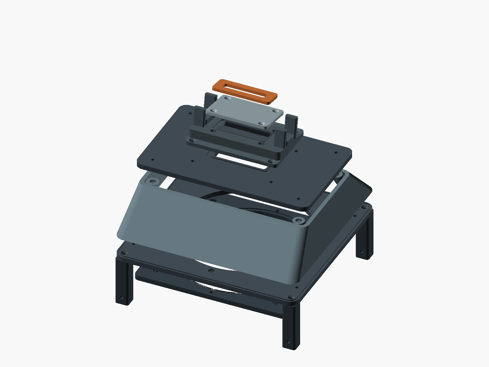

# Upright V2

V2 is a printable construction and fit-check prototype with a removable 140 mm
fan cartridge, a shallow tapered plenum, and a replaceable laptop interface.
The closed laptop leans rearward by 10°. V1 remains unchanged.

**Start with the blank insert and an unpowered fan.** The supplied 3D reference
is a base-M5 visualization, not a verified M5 Max mechanical model. The 44 × 8 mm
open insert is an experimental bench part. Confirm the hinge recess, gasket
contact, and intake/exhaust boundaries before testing it on the Mac. See the
[measurements and sources](../../docs/VENT_GEOMETRY.md).

To supply air from the llano V12 instead of a standalone fan, see the separate
[V12 validation adapter](v12_validation/README.md). Start with its footprint gauge;
the existing V12 outline has not been fit-checked on the cooler.



## Build and outputs

From the project root, with OpenSCAD installed, run:

```bash
make stl-v2
make preview-v2
python3 -m venv .venv
.venv/bin/pip install -r tools/requirements.txt
make check-v2 PYTHON=.venv/bin/python
```

Set `OPENSCAD` if the executable is not on your path. Outputs stay under
`build/upright_v2/`; `make stl` still builds V1. OpenSCAD's PNG renderer needs
access to a graphics context.

The [checked-in STL snapshot](stl/) contains the verified default prototype.
Rebuild after changing any parameter; the snapshot does not update automatically.
See the [validation record](../../docs/VALIDATION.md) for checks and limitations.

The source selector `PART` exports each part with its print base at Z = 0.
`PART="assembly"` displays the assembly, while `EXPLODE=20` separates it in
preview. `SHOW_REFERENCE` controls the illustrative fan and laptop envelope.
Those reference objects never enter STL exports. The assembly is for viewing;
print the individual parts.

## Parts and measured envelopes

All nine default exports passed the watertightness, consistent winding, positive
volume, and single-solid checks on September 15, 2026. Dimensions are in mm.

| STL | Quantity | Envelope | Print orientation |
|---|---:|---|---|
| `shell.stl` | 1 | 190 × 180 × 40 | Wide opening down |
| `base.stl` | 1 | 190 × 180 × 5 | As exported |
| `cartridge.stl` | 1 | 158 × 158 × 5 | Nut pockets up |
| `lid.stl` | 1 | 180 × 108 × 5 | As exported |
| `cradle.stl` | 1 | 96 × 64 × 29.24 | Flat flange down |
| `insert_blank.stl` | 1 initially | 64 × 42 × 3 | Countersinks up |
| `insert_open.stl` | Alternative | 64 × 42 × 3 | Countersinks up |
| `gasket.stl` | Foam template | 60 × 22 × 4 | Flat |
| `foot.stl` | 4 | 14 × 14 × 52 | Blind nut pocket up |

The assembled printed envelope is **190 × 180 × 129.24 mm**, excluding the laptop,
fasteners, and adhesive foot pads. The shell is 40 mm high, compared with V1's
55 mm plenum. The assembled height is nearly the same as V1 because the separate
cradle and insert need room above it.

Every part fits within a 190 × 180 mm rectangle. Allow room for a brim on the
printer. No split-body seam is needed on the project's nominal 250 mm bed.
Each foot includes a 2 mm square locating tongue that seats inside the base;
its exposed height is 50 mm. The tongue prevents rotation around the fixing bolt.

The shell has open top and bottom faces; its separate lid closes the chamber
after printing. The largest taper advances about 38 mm over 40 mm of height.
Nut-pocket roofs and the 4 mm cable-tie holes have short bridges. Inspect those
layers in your slicer before printing without supports. Mesh validation does not
replace a slicer check or load test.

## Hardware and sealing

Use a nominal 140 × 140 × 25 mm fan, with **124.5 mm** mounting-hole spacing.
It blows upward through a 136 mm opening. The nominal fan underside is 20 mm
above the desk. Fit a 140 mm intake guard before powering the fan, and keep
cables clear of its blades. The guard and fan power/control hardware are separate
parts; include the guard's thickness when choosing the M4 bolt length.

These are starting screw lengths for the modeled stack. Check your actual head,
washer, and fan dimensions before tightening; protruding screws must clear the
fan and neighboring parts.

| Joint | Screws | Nuts | Access |
|---|---|---|---|
| Feet to base | 4 × M3 × 12, countersunk | 4 × M3 | From above, before shell installation |
| Shell to base | 4 × M3 × 16, pan/socket head | 4 × M3 | From inside the open shell |
| Fan to cartridge | 4 × M4 × 30, pan/socket head | 4 × M4 | From below the fan |
| Cartridge to base | 4 × M3 × 12, pan/socket head | 4 × M3 | From below, outside the fan frame |
| Lid to shell | 4 × M3 × 12, pan/socket head | 4 × M3 | From above |
| Cradle to lid | 4 × M3 × 12, countersunk | 4 × M3 | From above the flange |
| Insert to cradle | 4 × M3 × 6, countersunk | 4 × M3 | From above, outside the contact strip |

Total: 24 M3 nuts and four M4 nuts. The nut-pocket allowances are parameters;
test a pocket before printing a full plate. Longer fans use a different `FAN_T`,
which increases the foot height and moves the complete body upward.

Apply closed-cell foam in the recessed seals at the base/shell, shell/lid,
lid/cradle, cradle/insert, and cartridge/base joints. The model seats rigid faces
together and gives the foam a 1.2 mm recess. Select foam that can compress into
that recess, then check for leakage. Seal pressure-chamber fasteners with suitable
bonded washers or a removable sealant; threads and printed nut pockets are not
airtight. Check the fan frame against the cartridge for leakage too.
The base/shell and shell/lid tracks are only 2 mm wide; carefully cut foam cord
or a suitable removable gasket compound may be easier than narrow foam strips.

For laptop contact, start with a **4 mm foam gasket**, using `gasket.stl` as a
cutting template. A TPU alternative needs a compression test before use. The
modeled compressed gasket is 3 mm high. It sits on the 3 mm insert, giving a
6 mm contact height measured perpendicular to the tilted seat. The rigid stops
are 5 mm high and need 1 mm soft pads to reach the same plane. Fit two 12 × 18 mm
stop pads and pad all four laptop-facing guide surfaces. Keep fastener heads
flush and away from the laptop.

## Assemble and test

1. Dry-fit the nuts and screws, then deburr the parts and fit the soft contact pads.
2. Fit the feet and captive base nuts. Seal and fasten the shell to the base.
3. Bolt the fan to its cartridge, then seal and screw the cartridge to the base.
4. Fit the lid's underside nuts before installing the cradle. Seal and fasten the lid.
5. Fit the insert nuts, insert seal, blank insert, and foam gasket.
6. Check the cradle with a padded dummy first. Verify that the stops carry the
   load and that the rigid insert cannot contact the laptop. The 5 mm lid spans
   an approximately 168 × 96 mm cavity and has not been load-tested. Apply the
   laptop-equivalent load at both stops, then a gentle lateral cable load. Stop
   if the lid bows, cracks, or lets the gasket/contact height change.
7. Check the actual Mac's hinge and vent geometry before an unpowered test fit.
8. With the laptop removed and fan guard fitted, bench-test leaks with the blank
   insert. Install the notched open insert only
   after confirming the inlet and exhaust separation, then follow the
   [benchmark plan](../../docs/BENCHMARK_PLAN.md).

The four cartridge screws are separate from the fan bolts and the feet. With the
laptop removed and power disconnected, release those four screws and lower the
fan/cartridge assembly. The shell, lid, and cradle stay together.

Use the holes near the bottoms of the feet for cable ties on either side. Route
the fan cable along a foot and keep the underside inlet clear. The short central
guides leave the laptop's side ports accessible.

## Parameters to verify on the machine

`INTAKE_CENTER_X_TBD`, `INTAKE_W_TBD`, `INTAKE_D_TBD`, and
`EXHAUST_START_ABS_X_TBD` are provisional. The raised cradle ends at X = ±48 mm;
the default exhaust keepout starts at ±52 mm. The stops occupy X = 36..48 mm and
−48..−36 mm. These positions use the gaps in the reference mesh, so they require
checking on the actual Max.

`CHANNEL_W`, `GUIDE_PAD_T`, the gasket dimensions, and its compressed thickness
control contact and fit. Changes outside the documented lean and fan-thickness
options need fresh assembly and clearance checks. The source is editable; its
assertions do not cover every possible combination.

Still to validate physically: printing tolerances, rigidity under cable pull,
gasket compression, vent alignment, exhaust recirculation, fan pressure, and
sustained workload throughput. A watertight STL describes a closed geometric
solid; it does not prove an FDM print or its assembled seams are airtight.
