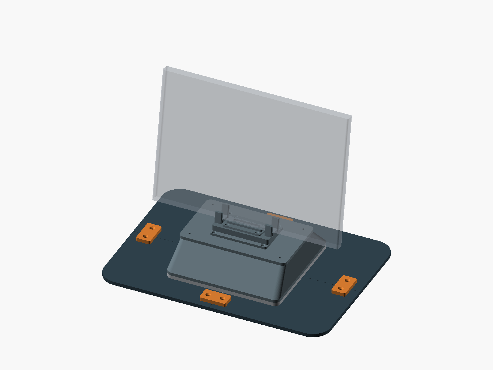
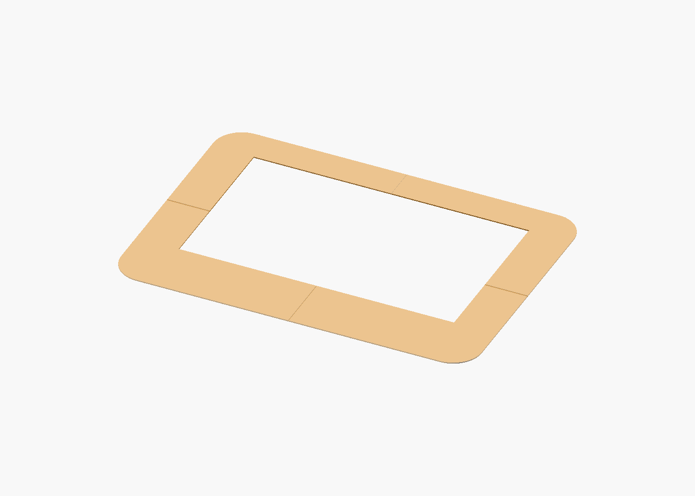

# V2 on the llano V12

This adapter replaces V2's fan cartridge and feet with a wide, sealed deck for
the llano V12. The existing V2 base, shell, lid, cradle, and laptop insert stay
unchanged. Air enters through the same 136 mm bottom opening.

The V12 pushes room air through the deck and plenum into the Mac's center hinge
intake. The two outer hinge exhausts and side chassis intakes stay open. Do not
reverse this center-fed path to extract air. See the
[airflow evidence and direction check](../../../docs/VENT_GEOMETRY.md#airflow-direction).

**Print the footprint gauge first.** The user has not fit-checked the existing
V12 panels. The 381 × 269 mm outline is taken from those STL files, not measured
from the cooler. This adapter is for construction and unpowered fit checks until
the support, seal, restraint, and load checks below pass. Do not put the Mac on
the gauge or power the V12 beneath an unsecured deck.



The translucent laptop is an envelope reference. The cooler, foam, and housing
restraint are not modeled. [Exploded adapter view](../../../renders/upright_v12_exploded.png).

## First prints

Use the [STL snapshot](stl/) or build from the project root:

```bash
make gauge-v12
make coupon-v12
```

Both commands write to `build/v12_validation/`. Set `OPENSCAD` if needed.

1. Print one each of `gauge_ne`, `gauge_nw`, `gauge_sw`, and `gauge_se`. These
   1.2 mm-thick pieces follow the old panels' outer profile and inner opening.
   In the source, +X is east and +Y is north; these are assembly labels, not a
   verified orientation on the V12. Before removing each tile from the print
   bed, mark its quadrant and a +Y arrow on top with a pen. The gauge has no
   printed IDs or alignment keys; do not add labels beneath its contact surface.
2. Assemble the gauge on a flat table, with a 0.3 mm gap between straight seams.
   Light tape is sufficient for this unloaded gauge. Verify the assembled outer
   width and depth with a ruler before judging fit on the cooler.
3. Place it on the unpowered V12. Check the full outer outline, foam inner/outer
   edges, raised features, controls, and cable exits. Photograph the fit from
   above and from the side. The gauge checks coverage, not airtightness.
4. Measure the foam height and compression, the deck angle, and where a rigid
   plate can bear load. Identify a positive restraint to the cooler housing that
   leaves its intake, controls, and cables clear. Foam friction is not a restraint.
5. Print `coupon_ne`, `coupon_se`, and `coupon_collar`. They reproduce the actual
   +X seam tab and M3 recess. Fit the two deck pieces beneath the collar coupon,
   using the intended M3 screw, washer, and a loose nut above. Confirm clearance,
   full head recess, and no cracking or separation when lightly tightened.

The default gauge window is 291 × 170 mm, centered at Y = 14.5 mm, and the outer
corner radius is 30 mm. These values reproduce the legacy panel geometry. They
are not a specification for the V12's foam or air outlet. Adjust the `_TBD`
parameters in the source and repeat the fit check if the outline misses.



## Adapter construction

After the gauge and joint coupon pass, export and check the complete adapter:

```bash
make stl-v12
make check-v12 PYTHON=.venv/bin/python
make preview-v12
```

Install the Python dependencies as described in the [V2 guide](../README.md).
`check-v12` checks every mesh, mating surfaces, screw envelopes, and the full
lower air path. It does not establish printed strength or actual cooler fit.

The deck uses four 6 mm tiles. A continuous 190 × 180 × 6 mm collar joins them
under V2, and four outer bridges hold the seam ends. Eight off-seam collar screws
and the bridge screws provide the structural joints. The round seam tabs locate
the tiles and keep each M3 head/washer inside one piece. Tape only seals air.

Print one of each `deck_*` part, one `collar`, and four `bridge` parts. The gauge
and coupon parts are not installed in the finished adapter. The deck is filled
except for its 136 mm inlet and fasteners; do not use the gauge's large rectangular
opening as a structural deck.

### Verified print envelopes

These are measured STL bounding boxes, not physical fit measurements. All 13
individual exports are watertight single solids. Each part fits within 200 mm
in X and Y before adding a brim; allow extra bed space for your slicer settings.

| Part | X × Y × Z, mm | Quantity |
|---|---|---:|
| `gauge_ne`, `gauge_nw`, `gauge_sw`, `gauge_se` | 190.35 × 134.35 × 1.20 | 1 each, gauge only |
| `coupon_ne` | 22.74 × 21.50 × 6.00 | 1, joint test only |
| `coupon_se` | 22.74 × 14.85 × 6.00 | 1, joint test only |
| `coupon_collar` | 22.74 × 30.00 × 6.00 | 1, joint test only |
| `deck_ne`, `deck_sw` | 190.35 × 141.00 × 6.00 | 1 each |
| `deck_nw`, `deck_se` | 197.00 × 134.35 × 6.00 | 1 each |
| `collar` | 190.00 × 180.00 × 6.00 | 1 |
| `bridge` | 44.00 × 24.00 × 6.00 | 4 |

The assembled printed envelope, including the existing V2 upper parts but not
the Mac or cooler, is 381 × 269 × 91.24 mm. Print the deck tiles flat with their
nut pockets and M3 counterbores facing the bed. Print the collar and bridges flat
with their countersinks facing up. Inspect the pocket roofs for bridge sag and
clear them before fitting hardware. Check the collar's face-down, 3 mm-wide seal
recess in the slicer too. First-layer spread must not narrow that recess or stop
the tiles from fitting. Use the same orientation for the coupons.

## Default hardware

These starting lengths apply to the 6 mm deck and 6 mm collar. Check purchased
hardware and actual printed dimensions before tightening.

| Joint | Hardware | Access |
|---|---|---|
| Collar to deck | 8 × M4 × 12 countersunk, 8 M4 nuts | From above, before V2 covers the collar |
| Four outer bridges | 8 × M4 × 12 countersunk, 8 M4 nuts | From above |
| V2 base to adapter | 4 × M3 × 16 pan head, 4 washers, V2's 4 cartridge nuts | From below, with adapter off the V12 |

The M4 × 12 length has almost no spare length across the two 6 mm layers.
Dry-fit a complete screw/nut joint before assembly and check thread engagement
without underside protrusion. The deck pockets start with a 0.25 mm
across-flats allowance and a 0.20 mm vertical allowance around the modeled
7.3 mm AF × 3.4 mm nut baseline. These are exposed starting parameters, not universal
FDM tolerances. The automated `m4_nut_fit` case checks the modeled-baseline nut plus a
separate 0.20 mm AF / 0.15 mm height test envelope in all 16 pockets, including
the pocket walls and roof; regression cases deliberately remove each source
allowance and must report a collision. Measure the purchased nuts and dry-fit
every pocket anyway, since first-layer spread, elephant foot, layer anisotropy,
printer calibration, and hardware variation are not certified by CAD.

Use washers no larger than 7 mm outside diameter. The M3 head recess is 8.2 mm
diameter and 3.5 mm deep. A 2.5 mm-high pan head plus a 0.5 mm washer sits about
0.5 mm above the deck underside. The 16 mm screw then extends about 2 mm beyond
V2's base into the empty plenum. Check this stack with your actual hardware.
Do not leave metal projecting below the deck.

Only 1.9 mm of printed material separates an M3 head recess from the inlet.
Inspect this ligament and the 2.5 mm recess floor closely. Use low tightening
force; reject cracks, voids, crushed layers, or a washer that cuts into the seat.
Increasing recess diameter needs another clearance and strength check.

## Assembly and seals

1. Deburr the tiles and dry-fit their tabs. Check the full outline, diagonals,
   flatness, and the 136 mm inlet.
2. Install the 16 captive M4 nuts from the deck underside. Fit the collar's lower
   annular seal before bolting the collar and four bridges onto the deck. All
   upper countersunk heads must be flush.
3. Fit the collar's upper annular seal. Both recesses cover diameters 136 to
   142 mm and are 1.2 mm deep. Choose foam that compresses into the recess so the
   rigid faces seat. The lower seal crosses tile seams; inspect those joints.
4. Remove V2's fan, cartridge, and all four feet. Retain the four cartridge nuts
   in its base. Seal the unused foot screw holes on the pressure side. Install
   or check the shell's underside nuts before the collar covers them.
5. Place the V2 base on the collar and insert the four M3 screws from below the
   deck. Check nut engagement and head recess. The rest of V2 assembles as in its
   [guide](../README.md), with the blank laptop insert first.
6. Seal every underside seam and fastener penetration with thin removable film,
   tape, or suitable sealant. Follow the curved seam around each tab. Keep the
   sealing surface flat; no stacked tape ridges beneath the cooler's foam land.
   Seal around the M3 heads as well as the M4 nut pockets.

All underside hardware needs access off the cooler. Do not add a second fan in
series, leave V2's fan in place, or use its feet as supports on the V12.

## Before a powered test

The deck is not secured to the V12 by its foam seal. Pressure can lift the deck,
and the upright laptop adds an overturning load. **Positive housing restraint is
required.** No strap route or attachment point is modeled because the actual
cooler has not been measured. Do not drill the V12 or route straps across its
inlet or controls to make this prototype fit.

Load-test the complete adapter with a padded dummy on a rigid test fixture before
using the Mac. Then verify its support and restraint on the unpowered V12. Check
for deck bow, seam opening, collar lift, slipping, and tipping under cable load.
The V2 cradle's 10° lean is relative to the deck, not the desk; check the actual
combined angle and keep the laptop stable. Do not assume the V12's tilted stand
settings are suitable for an upright laptop.

After the fit, restraint, and load checks pass, leak-test the blank-insert assembly
without the Mac. Confirm the separate [Mac-side fit requirements](../README.md)
before using the experimental open insert. Start the V12 at low speed and stop
if the deck moves, seals lift, or exhaust is obstructed.

This arrangement tests V2's airflow path with the V12 pressure source. It does
not establish that a standalone 140 mm fan will produce the same result. Use the
[benchmark plan](../../../docs/BENCHMARK_PLAN.md) to compare sustained work.
